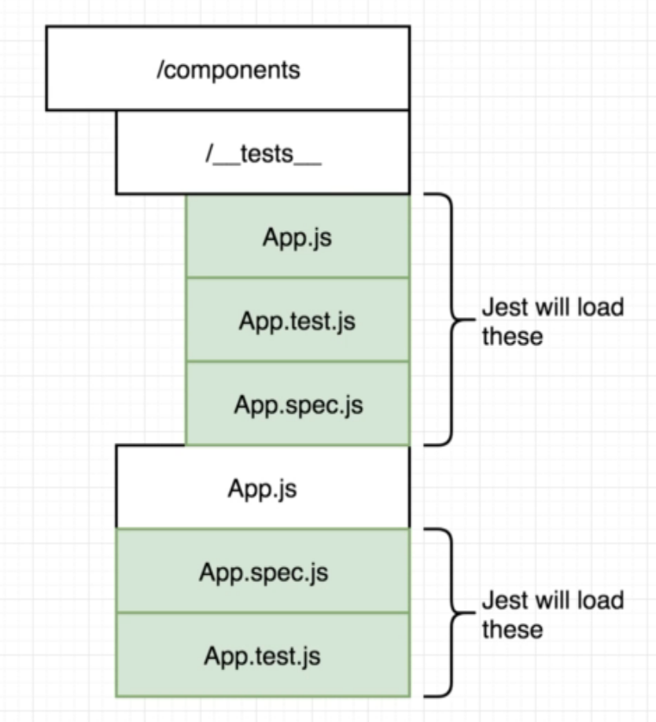
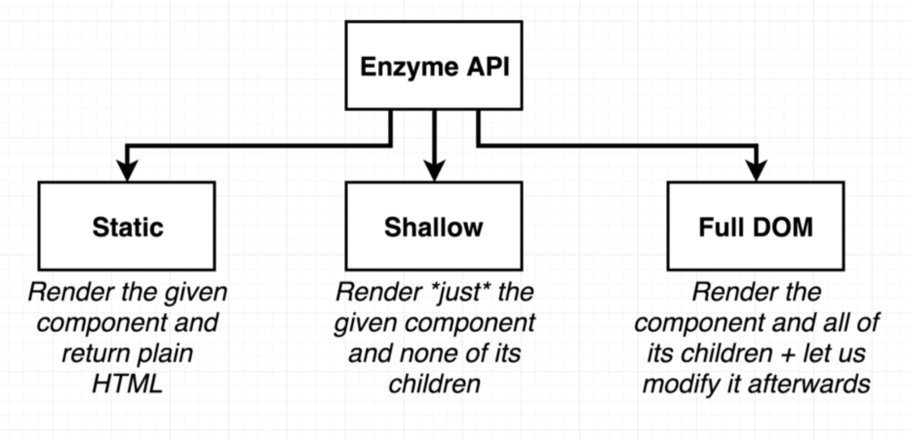

# Testing 2019

possible ways to define test file

## Jest

- simulate browser in command line
- creates JSDOM, which simulates how browser behaves
- React "thinks" it runs in browser

## Enzyme

- used to evaluate the test
- supplies us with the expect method
- setup with `setupTests.js` - name has to be exact
- enzyme renders
  
